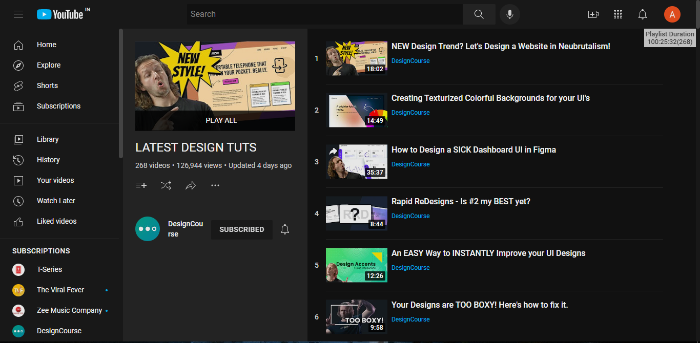

<h1 align="center"> YouTube Playlist Duration [Chrome Extension] </h1>

YouTube Playlist Duration unobtrusively displays the total duration of YouTube playlists. This Chrome extension is great for easily viewing the duration of playlists for online courses, music albums, podcasts, and more.

  
  
  

 

## 💻Preview

## Working

<ul>
<li>Load Youtube Playlist page.</li>
<li>If that Playlist has more than 100 videos scroll down to bottom, Click on HTML element with Playlist Duration. That's It 😉✌</li>
</ul>

## Features

<ul>
<li>Works with playlists consisting of more than 100 videos.</li>
<li>Unobtrusive positioning. Click on the duration box to hide it.</li>
</ul>

## Known Issues

<ol>
 <li>Occasionally, the page must be refreshed for the duration counter to update.</li>
 <li>Try restarting Chrome if the extension doesn't load.</li>
<li>Extension may not work due to pre-installed ad-blockers.</li>
</ol>

<h2> ⚙ Installation </h2>
<ol>
  <li> Download zip file from clone or release and Extract it. 
  <li>Unzip that zip file in your folder.</li>
<li>Then Open Chrome Browser.</li>
  <li>Paste <code>chrome://extensions</code> in Url Bar.</li>
  <li> Turn On Developer Mode. 👨‍💻
  </li>
  <li>Click on Load Unpacked and select that unzipped folder and Click Select.</li>
  <li>Now you can use the extension ✨</li>
  </ol>
  
<h2>📝 Contribute</h2>
This Repo is open to contribution and modifications, 
- <b>Star</b> this Repo. 
- <b>Fork</b> this Repo. 
- <b>Clone</b> Repo from your github to local. 
- Create a <b>new branch</b> and do edits. 
- <b>Push</b> to orgin. 
- Create <b>Pull Request</b>. 
  

<b><i>Star this Repository and visit my profile and see more Projects like this.</i></b>
